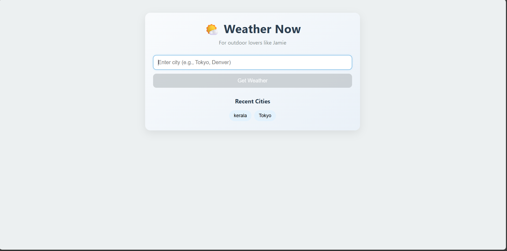
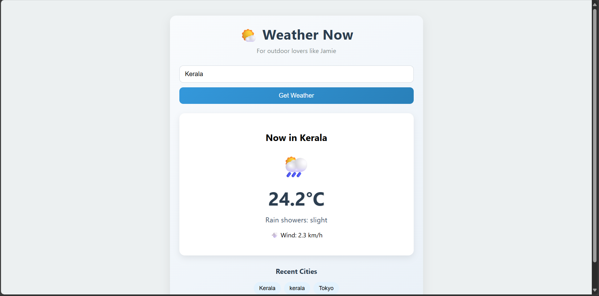

# 🌤️ Weather Now — Instant Weather for Outdoor Adventurers

**Weather Now** is a fast, simple, and responsive web app built for **Jamie** — the outdoor adventurer who needs **quick, reliable weather updates** before hitting the trails, beach, or bike path.  

> “Will it rain during my hike? Is it windy at the lake?”  
> **Weather Now answers in seconds.**

---

## 🖼️ Screenshots

|  Page View | Search View |
|--------------|--------------|
|  |  |

# Demo - [Video](https://drive.google.com/file/d/1tCi8pucinZEp-fUzvuZE_f5_y7iuFGyG/view?usp=drive_link)

---

## ✨ Features

- 🔍 **City Search** – Find weather data for any city (*Kyoto*, *Denver*, *Cape Town*, you name it).  
- 🌍 **Smart Geocoding** – Converts city names into coordinates via [OpenStreetMap Nominatim](https://nominatim.org/).  
- 🌦️ **Clear & Friendly Forecasts** – Combines icons and plain-language descriptions (e.g., *“Rain showers: slight”* 🌦️).  
- 📊 **Current Conditions** – Instantly view temperature (°C), wind speed (km/h), and weather type.  
- 🕒 **Recent Searches** – Automatically saves your last 5 cities in local storage.  
- 📱 **Responsive by Design** – Works smoothly across mobile, tablet, and desktop.  
- ⚠️ **Error-Proof Experience** – Handles typos, missing cities, and network hiccups gracefully.  
- 🌀 **Loading Feedback** – Shows friendly “loading” indicators while fetching data.  

## 🛠️ Tech Stack

| Category | Technology |
|-----------|-------------|
| **Framework** | React (Create React App) |
| **Styling** | Vanilla CSS |
| **APIs** | [Open-Meteo](https://open-meteo.com/) for live weather data   [Nominatim (OpenStreetMap)](https://nominatim.org/) for city geocoding |
| **Persistence** | Browser `localStorage` |
| **Auth / Keys** | None required (both APIs are public and free) |

### 🚀 Getting Started

To run **Weather Now** locally:

# Clone the repository
git clone https://github.com/your-username/weather-now.git
cd weather-now
# Install dependencies
npm install
# Start the development server
npm start
The app will be available at 👉 http://localhost:3000

### 🌐 Live Demo

Try it instantly on CodeSandbox:
👉 https://hqlkf5-3000.csb.app/

### 🤖 Built with AI Collaboration

This project was co-developed with iterative guidance from AI to:

Translate Jamie’s user need (“quickly check the current weather for any city”) into design goals

Create a clean component structure (SearchBar, WeatherCard, weatherService)

Integrate public APIs for geocoding and weather data

Add loading states, user-friendly error messages, and local search history

Polish the UI with Unicode icons and a fully responsive layout

🔗 Full build conversation log:
https://chatgpt.com/share/68ff6962-2068-800d-abea-e6c8f62382b8

### 📝 Project Notes

Built for a UI take-home challenge addressing User Need #2: Weather Now

Focused purely on current weather for simplicity and speed

Designed for clarity, accessibility, and minimal dependencies

No API keys or user accounts required

### 💡 Future Enhancements

Add a 3-day or hourly forecast

Auto-detect user location via browser

Cache API results for offline use

Add a dark/light mode toggle
